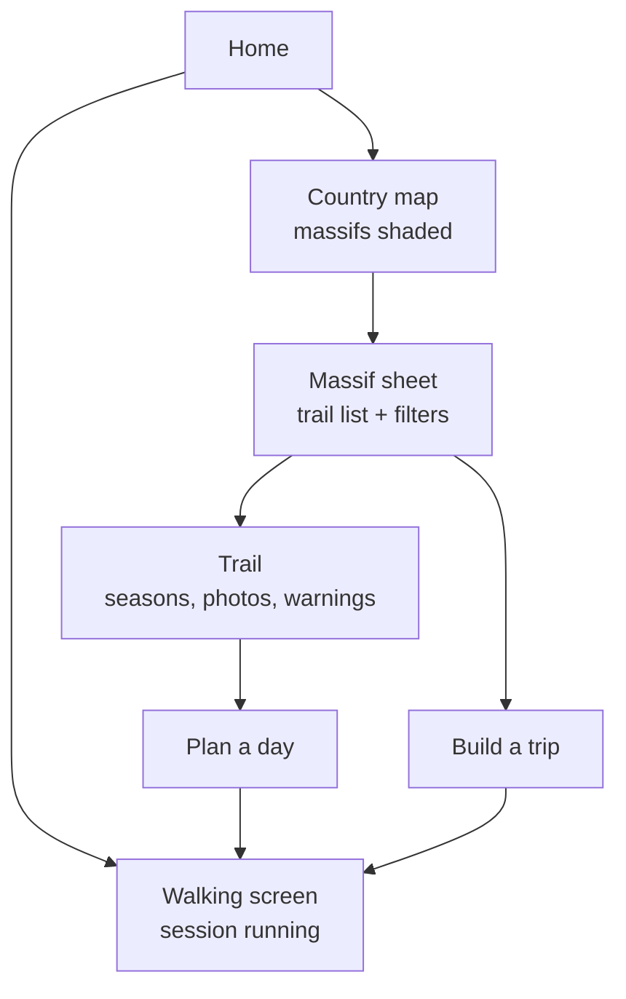
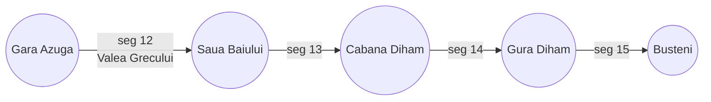
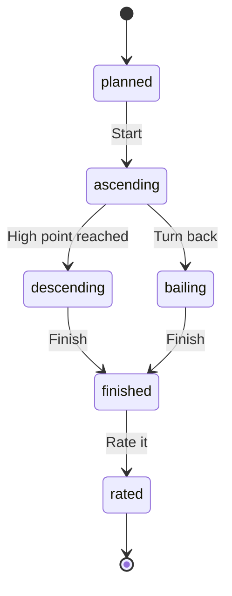

# Hiking site — technical specification

2026-09-19 · @Magargiu Alexandru Razvan

## Purpose and scope

A private site that plans a hike, records what happened on it, and photographs the same viewpoints every season. One user at the start, friends later, no public access. Rail access is the author's own constraint and a filter in the product, never an assumption baked into the model: most people who might use this later will drive.

The test for any feature: it must either help choose the next route, keep the walker safe on it, or make the record of the walk richer. A feature that only displays data the walker already has does not go in.

The seed content is the existing database of 185 routes reachable by train from Bucuresti Nord. The geographic scope is the Romanian Carpathians reachable by rail, starting with Bucegi, Baiului, Piatra Mare, Postavaru, Piatra Craiului and Ciucas.

## Access

One shared password protects the whole site, held as an argon2id hash in an environment variable. No user table at the start.

- Next.js middleware checks an httpOnly cookie on every route except `/login` and the health check. The cookie is **not signed**, decided on 2026-09-19: it carries one opaque 256-bit random id and nothing else, and the API checks it against Redis on every request. A signature authenticates claims, and there are none here; forging the cookie means guessing 256 bits either way, and no code path skips the Redis lookup, so a signature would add a secret to manage and nothing else.
- The cookie lasts 30 days, is `SameSite=Lax` and `Secure`, and carries no user data beyond a session id.
- Rate limit the login route to 5 attempts per IP per 15 minutes.
- Do not use HTTP Basic auth. It cannot log out, and the password appears in proxy logs.

Build the schema so that accounts can arrive later without a migration of every table: give every row that belongs to a person an `owner_id` column now, defaulted to a single seed user. When friends join, the column already exists and the queries already filter on it.

## Architecture and hosting

Everything runs on one VPS under Docker Compose. A single host removes the free-tier caps on photo storage, the idle pausing of managed databases and the function time limits that would break the import jobs.

| Service | Image | Role |
| --- | --- | --- |
| `web` | Next.js, standalone build | Frontend and the password gate |
| `api` | NestJS | REST API, jobs, live-tracking ingest |
| `worker` | NestJS, same image, different command | BullMQ consumer: photo, GPX and DEM jobs |
| `db` | postgis/postgis:17 | Postgres with PostGIS |
| `redis` | redis:7 | Job queue and rate limits |
| `storage` | MinIO, or Cloudflare R2 instead | Photo originals and derivatives |
| `proxy` | Caddy | TLS from Let's Encrypt, one domain, two upstreams |

The frontend is styled with Tailwind v4 and uses shadcn/ui components, whose code is
owned in the repository and themed through CSS variables. Design rules live in
`docs/design.md`.

Sizing: 2 vCPU, 4 GB RAM, 40 GB disk covers everything except photos. Put photos on a separate block volume or in R2, so the disk can grow without a server migration.

**Photo storage.** At 50 photographs a hike the volume is smaller than it feels, so capacity is not the urgent problem. Backup is.

| Item | Per hike | Per year at 4 hikes a month |
| --- | --- | --- |
| Originals, about 4 MB each | 200 MB | 10 GB |
| Derivatives in AVIF, three sizes | 35 MB | 1,7 GB |
| Panoramas, 3 at 12 MB | 36 MB | 1,7 GB |
| Total | 270 MB | about 14 GB |

A 100 GB volume therefore holds six years. The rule that matters is different: **write S3-compatible code from day one**. Run MinIO on the VPS now and every later move is a change of endpoint and credentials, not a rewrite.

Off-VPS, two roles, and they are not the same provider:

- **Archive, decide now:** Backblaze B2 at about 6,95 USD per TB per month, first 10 GB free, egress free up to three times what you store. A nightly `rclone sync` of the originals bucket costs a few cents a month and removes the only irreplaceable risk in this project.
- **Serving, decide later:** Cloudflare R2 at about 0,015 USD per GB-month with no egress charge, worth moving to only if the site ever serves people other than you. For one private user the VPS serves the derivatives fine.

The decision to take this week is the nightly sync to B2, not the migration off the VPS.

Deploy through GitHub Actions: build both images, push to the GitHub container registry, then `docker compose pull && up -d` over SSH. Database migrations run as a one-shot container before the API starts.

Decision: plain Docker Compose with a deploy script, not a management panel. Coolify and Dokploy earn their keep across many projects; here they add a service that can break, consume RAM and hide what the deploy actually did. One `docker-compose.yml` in the repository is reproducible and reviewable. Move to a panel only when this VPS holds a third unrelated project.

Postgres never listens on a public port. The API reaches it over the Compose network only.

## Clients and platforms

The phone is the primary client. The desk browser plans a trip and edits data in bulk; the phone does everything else, in one hand, in gloves, on a bright screen.

**Widths.** Design the canvas at 390 px, guarantee correctness down to 320 px, and never design a separate 320 px layout.

| Width | What sits there | Treatment |
| --- | --- | --- |
| 320 | Almost no current phone. It is the WCAG reflow floor, and where a 360 px phone lands once text is enlarged, in a split screen, or on a folded cover screen | Must not clip or scroll sideways. Single column, chips scroll horizontally |
| 360 | The most common mobile viewport worldwide, driven by Samsung's Galaxy A and S ranges | Fully supported, single column |
| 390 to 393 | iPhone 14 to 16 and Pixel | The design canvas |
| 412 to 430 | Large Android and iPhone Pro Max | Wider gutters, nothing new |
| 768 and up | Tablet and desktop | Map beside the sheet rather than under it |

Real device share clusters between 360 and 414 px, and 320 px appears nowhere in the current rankings. So 320 px is not a device target. It is an accessibility floor: a Galaxy at 360 px with text scaled up, or in split screen, or a foldable's cover screen, produces the same pressure on the layout, and WCAG 2.1 requires content to reflow at 320 px without two-dimensional scrolling.

The cost of honouring it is near zero if it is a build rule rather than a design:

- No fixed pixel widths anywhere. `min-width: 0` on flex children, `max-width: 100%` on media.
- Tables, code and diagrams live inside their own `overflow-x: auto` container, so the page body never scrolls sideways.
- Below 360 px, drop to one column and let the filter chip row scroll horizontally.
- Stat grids go from three columns to two, never to a squeezed three.

The walking screen survives it comfortably: four targets at 48 px with gaps needs about 250 px, so the one screen that matters in bad conditions fits at 320 px with room left.

**Other rules:**

- Every action reachable with a thumb, no hover state carrying meaning, targets of at least 48 px.
- High-contrast mode for direct sun, and a dark mode that does not glow at 05:00 on the train.
- The map fills the screen; controls float over it rather than shrinking it.
- Test at 320, 360, 390 and 412 before anything ships. Four widths, not a device list, because device-specific breakpoints age badly.

**Native apps come later, so build for them now.** Two rules keep that door open at no cost:

1. The API is the only way into the data. The Next.js frontend calls the same endpoints a native app would, with no server-side shortcut into the database.
2. Authentication is a bearer token issued by the API, with the web client storing it in an httpOnly cookie. A native client uses the same token flow without a second auth system.

When the native apps arrive, the choice is between React Native, which shares your TypeScript and models, and two native codebases, which win on camera, compass and background location. The one function that justifies going native is background position recording, which a browser on Android cannot do. Everything else works as an installed progressive web app first.

Ship the web app as a PWA from phase 1: installable, offline shell, and the Web Share Target that takes photos from the gallery.

**Language.** The interface is English. Place names stay Romanian, with diacritics, followed by a translation in brackets on first mention on a page: Prăpăstiile Zărneștiului (Zărnești Gorges), Șaua Baiului (Baiu Saddle), Valea Cerbului (Stag Valley).

- `route.name_ro` is the canonical name and the one that matches the signposts. `route.name_en` holds the gloss and may be empty.
- Never translate a name on a signpost, a map or a route card. On the mountain you read what the paint says.
- Search matches both forms, and matches without diacritics, because nobody types ș and ț on a phone in the rain.

## Navigation and screens

The map is the spine: a country map that opens into a massif, a massif that opens into a trail, a trail that opens into a plan. The map never goes away; a bottom sheet grows over it. Four page transitions in one hand is three too many.



### Home is context-aware

Four states, checked in order. Only the fourth is the map.

1. A session is running → home **is** the walking screen, and nothing else.
2. A plan or trip starts within 48 hours → home is that plan, with weather, departure and turnaround time.
3. A walk finished in the last three days and is unrated → home is the rating card.
4. Otherwise → the country map.

Assumption to confirm: on the phone, state 4 opens the country map with the sheet already resting at "candidates for next weekend", so browsing and planning both start in one place. Say the word and it opens clean instead.

### The country map

Massifs shaded by one of three metrics, switchable, defaulting to the third:

- share of the marked network walked, by length
- routes walked out of routes known
- **time since you were last there**, which is the one that helps you choose where to go

The first two are near-zero at launch and will stay dark for Făgăraș for a decade, which makes a discouraging first screen. The third is useful from day one.

Massif polygons are not official and they overlap, so draw them once, accept they are approximate, and fix one rule: **a route belongs to the massif of its key point.** Nothing then lands in two.

Do not ask for location on launch. A dot over Bucharest at country zoom tells you nothing and spends the permission at the worst moment. Ask when it first earns something: starting a session, or a "near me" action. At country zoom, travel time from your access point is the more useful thing to show.

### Filters

Six chips on the screen, everything else in a drawer. Twenty filter rows on a phone is a wall nobody opens.

**Chips:** Not walked · In season now · Fits one day · Quiet · Reachable by my mode · Difficulty at most N

**Drawer:** massif, category, technical grade, distance, ascent, travel time, approach from the access point, route shape, water, shelter, camping possible, protected area, rock, forest, my rating, last visited, warnings.

Two things matter more than the filter list itself:

- **Saved filter sets.** "Saturday easy", "winter safe", "quiet and new". You will use three of these forever and never open the drawer again. Filter state lives in the URL, so a set is a link.
- **A default sort**, not just filters. Default to best fit for the coming weekend.

### Two plan flows, one plan

Both directions have to exist, and both end at the same object.

| Starting point | The app answers |
| --- | --- |
| **Trail first** | Which dates work, given season, daylight, departures and forecast |
| **Date first** | Which routes fit that day, ranked, with the departure already chosen |

Without the second, you pick the date in your head and then hunt the list for something that fits, which is the work the site exists to do.

### Trips are a separate entry

Do not grow the single-day plan into a trip planner. "Build a trip" starts from the massif sheet, asks base stay or traverse, then takes days and nights. A different shape deserves a different screen.

### One row that must not be left out

The planner carries **stations due for a repeat this season** as its own row, above the candidates. Seasonal repeats are the reason this project exists, and nothing else in this flow surfaces them.

## The trail network as a graph

A route is a path through a network, not a line of its own. Azuga to Diham to Bușteni and Bușteni to Gura Diham share six kilometres of the same path, and a model that stores two independent lines gets four things wrong at once.

- Coverage double-counts ground walked twice.
- A condition log about a washed-out bridge attaches to one route while five others cross the same bridge.
- You cannot compose a variant from parts you already hold.
- You cannot answer "I have already walked 80 percent of this new route".

The model instead:



A node is a junction or an endpoint. A segment is the marked path between two nodes, carrying its own geometry, marking, terrain, distance and ascent. A route is an ordered list of segments with a name and a purpose.

Everything observed on the ground attaches to the segment: condition logs, junctions, photographs, warnings, water, shelters, slope and rock type. Everything planned attaches to the route: seasonal difficulty, train times, the turnaround calculation.

Coverage then becomes the share of segments walked, by length, which is the only honest version of that number. It also gives you route composition for free: pick two nodes and the site builds a route from segments you may have walked already.

**Do this at phase 2, when the OpenStreetMap import lands.** The import gives you most of the graph without extra work, because OSM ways already split at junctions. Retrofitting the graph after 300 visits and 4.000 photographs is a rewrite, not a migration.

## Data model

PostGIS holds every geometry in EPSG:4326. Keep the raw track and a simplified copy; the map reads the simplified one.

```sql
-- the network
node           (id, point geography(Point), kind, name)
segment        (id, from_node, to_node, geom geography(LineStringZ), marking,
                terrain, km, ascent_m, descent_m, source, licence, osm_way_id,
                slope_histogram jsonb, aspect_histogram jsonb, shade_profile jsonb)
segment_rock   (segment_id, rock, share)
segment_cover  (segment_id, cover, share, source)
segment_pa     (segment_id, protected_area_id, zone_type)

-- catalogue and access
access_point   (id, kind, name, point geography(Point), altitude_m, note)
-- kind: station | parking | bus_stop | trailhead
station        (access_point_id, changes, line, note)
parking        (access_point_id, surface, capacity, fee, winter_access,
                high_clearance, theft_risk, last_verified_on)
route_access   (route_id, access_point_id, role, approach_min, mode, note)
-- role: start | finish ; mode: train | car | bus | mixed
timetable      (id, station_id, direction, departs_at, arrives_at, operator,
                train_no, runs_on, valid_from, valid_to, note)
massif         (id, name, area geography(Polygon))
route          (id, massif_id, name_ro, name_en, start_station_id,
                finish_station_id, walk_min, bus_min, shape, notes,
                historic_source, historic_status, geom_simple)
route_segment  (route_id, position, segment_id, reversed)
route_category (route_id, category, is_primary, set_by, set_on)
route_season   (route_id, season, hiking_difficulty, technical_grade, overall,
                required_gear, daylight_note, status, note, set_by, set_on)
edit_log       (id, table_name, row_id, field, old_value, new_value, at, by)

-- protected areas
protected_area (id, name, designation, iucn_category, geom geography(Polygon),
                authority, source_url, fetched_on)
pa_zone        (id, protected_area_id, zone_type, geom, entry_allowed)
pa_rule        (id, protected_area_id, topic, rule_text, source_url, checked_on)

-- what happened on the ground
visit          (id, owner_id, route_id, started_at, finished_at, moving_s,
                pack_kg, companions, mood, energy, note, track geography(LineStringZ))
visit_train    (visit_id, leg, train_no, planned_at, actual_at)
condition_log  (id, visit_id, segment_id, snow_line_m, mud, blowdown,
                water_level, marks_visible, cable_state, free_text)
weather_snap   (id, visit_id, temp_c, wind_kmh, precip_mm, source, fetched_at)
particularity  (id, visit_id, point, kind, description, photo_id,
                seen_on, still_there_on)
phenology      (id, visit_id, category, observed_on, point, value, photo_id, note)
sheepfold      (id, point, first_seen_on, last_seen_on, active, dogs_count,
                dog_behaviour, note)

-- photographs
photo_station  (id, segment_id, point, bearing_deg, distance_along, name,
                purpose, reference_photo_id, sun_azimuth, sun_elevation)
photo          (id, station_id, visit_id, taken_at, season, kind, blob_key,
                lat, lon, bearing_deg, capture_mode, exif jsonb, caption)
-- photo.kind: flat | panorama ; season is set on every photo, station or not

-- navigation and safety
junction       (id, segment_id, point, distance_along, instruction, photo_id)
bailout        (id, segment_id, point, exit_to, minutes, note)
water_point    (id, segment_id, point, kind, last_verified_on)
shelter        (id, point, kind, capacity, locked, water_nearby,
                distance_from_route_m, last_verified_on, note)
route_warning  (id, route_id, segment_id, kind, season, severity, note,
                source, fetched_at, set_on)
poi_offroute   (id, segment_id, point, name, detour_m, detour_min,
                path_exists, risk_note)

-- the session and its ratings
session        (id, visit_id, state, started_at, high_point_at, finished_at,
                bail_point, bail_reason, plan_snapshot jsonb,
                parking_point, parking_photo_id)
-- session.state: planned | ascending | descending | bailing | finished | rated
key_point      (id, route_id, segment_id, point, kind, name)
trail_rating   (id, visit_id, route_id, scenery, navigation, underfoot,
                solitude, access, water, photo_value, best_season,
                beginner_ok, would_repeat)
day_rating     (id, visit_id, perceived_effort, enjoyment, weather,
                trail_condition, verdict)
voice_note     (id, visit_id, point, recorded_at, blob_key, transcript)
peak           (id, name, altitude_m, point, massif_id)
peak_ascent    (peak_id, visit_id, reached_at)

-- the walker
profile        (owner_id, dob, height_cm, home_point, home_clip_m,
                preferred_access_mode)
body_metric    (id, owner_id, on_date, weight_kg, resting_hr, note)
pace_model     (id, owner_id, season, fitted_on, flat_kmh, ascent_m_per_h,
                descent_factor, load_factor, n_samples)
benchmark      (id, owner_id, route_id, label)

-- gear
gear_item      (id, owner_id, name, category, weight_g, price, currency,
                bought_on, retired_on, retire_at_km, retire_at_hours)
gear_kit       (id, owner_id, name, season)
gear_kit_item  (kit_id, gear_item_id)
visit_gear     (visit_id, gear_item_id)

-- live tracking and devices
device         (id, owner_id, kind, label, external_id, credentials_ref, active)
-- device.kind: phone | inreach | garmin_watch | file_import
track_session  (id, owner_id, visit_id, started_at, ended_at, status)
position       (id, session_id, ts, point, alt_m, accuracy_m, battery, source)
checkin        (id, visit_id, due_at, contact, sent_at, acknowledged_at)

-- people and trips
companion      (id, owner_id, name, pace_factor, n_shared_visits, note)
visit_companion (visit_id, companion_id)
trip           (id, owner_id, name, kind, start_on, end_on, massif_id, note)
trip_day       (id, trip_id, day_no, on_date, kind, visit_id, note)
overnight      (id, trip_id, on_date, kind, accommodation_id, campsite_id,
                point, altitude_m, booked, cost, note)
next_day_check (id, visit_id, on_date, soreness, sleep_quality, pain_note)
plan_link      (id, visit_id, trip_id, token, expires_at, revoked_at)

-- money
cost_entry     (id, visit_id, kind, amount, currency, note)
```

**Prisma and PostGIS.** Prisma has no geometry type. Declare the spatial columns as `Unsupported("geography(LineStringZ, 4326)")`, which Prisma will carry through migrations without reading, and write every spatial query with `$queryRaw`. Create the extension in a hand-edited migration as the first step. Route matching, `ST_LineLocatePoint` and the coverage calculation are all raw SQL, so keep them in one repository file rather than scattered through services.

Indexes that matter: GiST on every geography column, a B-tree on `position (session_id, ts)`, and a GIN index on the notes for full-text search.

Keep `source` and `licence` on `route`. Geometry taken from OpenStreetMap is ODbL and must stay separable from tracks you recorded yourself.

## Route catalogue and map

The catalogue is the spreadsheet, made queryable. The list view keeps the filters that already work: massif, start station, stage, season, maximum day length, quiet routes only, walking only, hide the ones already walked.

Derived columns stay derived. Store `km`, `ascent_m`, `terrain` and `technical`; compute moving time, day length, effort points, difficulty and stage in one SQL view, so a corrected distance updates everything.

**Energy estimate.** The route page computes energy from the MET value of the terrain, the moving time and your current body mass and pack weight, read live from the profile rather than frozen into the route. Show one figure with a plus or minus 25 percent band. A precise-looking number here would be false precision, and it recomputes by itself as your weight and your fitted pace change.

Map layer:

- MapLibre GL in the frontend, vector tiles throughout.
- Base map self-hosted as PMTiles: cut a Romania extract from the Protomaps basemap build, roughly 300 to 400 MB, served as one file over HTTP range requests through Caddy. No tile server process to run or keep alive.
- Contours generated per massif, not nationally: `gdal_contour` over the Copernicus 30 m DEM, then tippecanoe, then PMTiles. A 20 m interval keeps the files small enough to load on a phone.
- Hillshade from terrain-RGB tiles of the same DEM, rendered by MapLibre in the browser. Generate them per massif alongside the contours.
- Budget 20 to 30 GB of disk for tiles once several massifs are in.
- Route lines coloured by the current season's difficulty, technical routes dashed.

Self-hosting the tiles from the start is the right call and costs one extra build step. It also removes the only external service the map would otherwise depend on, which matters for a site meant to work when you are somewhere it cannot reach.

Geometry import:

1. Pull `route=hiking` relations for each massif from the Overpass API and store them with `source = 'osm'`.
2. Match each of the 185 seed rows to a relation where one exists; leave the rest with no geometry until you walk them.
3. Replace an OSM line with your own recorded track once you have walked the route, and set `source = 'own'`.

Elevation profile comes from a DEM, not from GPS altitude. Sample the Copernicus 30 m DEM along the line every 25 m and sum only rises above a 10 m threshold. GPS altitude over-counts ascent badly and would make every figure in the catalogue wrong.

## Data sources and licensing

Of the three sources named, one can be imported and two cannot. This is a legal limit, not a technical one, and it decides the whole import design.

| Source | What it is | Can it be imported |
| --- | --- | --- |
| OsmAnd, Organic Maps | Renderers of OpenStreetMap data, not route databases of their own | Yes, by taking the data from OpenStreetMap directly |
| Munții Noștri | Proprietary cartography by Schubert & Franzke, sold as printed maps | No. Copyrighted work, no licence to redistribute |
| Wikiloc | User-uploaded tracks, each owned by its author | No bulk import. Terms forbid scraping, and the uploader holds the rights |

The good news: OpenStreetMap is what OsmAnd and Organic Maps display, and it already holds the Romanian marked network as `route=hiking` relations carrying the blaze in `osmc:symbol`. Importing OSM gives you national coverage on day one.

**Import pipeline.**

1. Download the Geofabrik extract for Romania, refreshed monthly.
2. Load it with osm2pgsql into a staging schema, separate from your own tables.
3. Promote `route=hiking`, `route=foot` and `route=mtb` relations into `route`, with `source = 'osm'` and `osm_relation_id` kept for re-syncing.
4. Re-run monthly and report what changed, never overwriting a row you have edited by hand.

**Licence obligations.** OpenStreetMap is ODbL. Attribution is required on any page showing the data. Share-alike applies to a derived database, which is why `source` and `licence` sit on every route row: your own recorded tracks stay separate and stay yours.

**Other legitimate sources worth pursuing.** The officially registered routes (trasee omologate) are held by the county Salvamont services and the national tourism authority. Some counties publish them. Asking one county for its register costs an email and may be the best data in the country.

Wikiloc is still useful one track at a time, for a route you intend to walk yourself. Download it as a person, walk it, then record your own track and keep that. The rule is simple: no bulk, no redistribution.

**Massif order.** One massif at a time, nearest first, each one finished before the next begins.

1. Bucegi, east side: Sinaia, Bușteni, Azuga
2. Baiului and Gârbova: Azuga, Predeal, Sinaia
3. Piatra Mare and Postăvaru: Timișu de Jos, Timișu de Sus, Brașov
4. Piatra Craiului and Perșani: Zărnești, Râșnov, Codlea
5. Ciucaș, by bus from Măneciu
6. Bucegi, west and north: Ialomița valley, Mălăiești

**Reconciliation.** The 185 seed routes are a starting point, not a survey. For each massif in turn, pull the OpenStreetMap relations, line them up against the seed rows, and produce three lists: routes present in both, routes in OpenStreetMap that the seed list missed, and seed routes with no relation to match. The third list is the interesting one, because it holds either an error of mine or a trail nobody has mapped.

Expect the second list to be long near Bucharest. Bucegi alone carries far more marked line than 60 routes, and the sub-mountain hills around Câmpina, Breaza and Vălenii de Munte are barely represented in the seed data.

## Classification and seasonal difficulty

A trail is not one kind of thing, and it is not one difficulty. Both facts need a many-to-many table rather than a column.

**Categories.** Every route carries one primary category and any number of secondary ones, each with a confidence and an author, so an OSM import can propose and you can correct.

| Category | Meaning |
| --- | --- |
| `walking` | Flat or gentle, any shoe, no navigation demand |
| `wood_trail` | Forest road or forestry track, wide, easy underfoot |
| `hiking` | Marked mountain trail, walking pace, no hands |
| `scramble` | Hands needed, no rope |
| `via_ferrata` | Cable, rungs, ferrata kit required |
| `mountaineering` | Alpine route, rope, helmet, partner |
| `bouldering` | A crag reached by the route, pads and shoes |
| `ski_touring` | Skinned ascent, winter only |
| `snowshoe` | Winter walking route |
| `cave_approach` | The walk to a cave entrance |

The same line can be `hiking` in July and `snowshoe` in February. That is not a contradiction; it is the reason category and season are separate tables.

**Seasonal difficulty.** One row per route per season, which becomes the unit the catalogue filters on:

```sql
route_season (route_id, season, hiking_difficulty, technical_grade,
              overall, required_gear[], daylight_note, status, note,
              set_by, set_on)
-- season: spring | summer | autumn | winter
-- status: normal | harder | dangerous | closed
```

Prăpăstiile Zărneștiului is 5/10 in July and 8/10 in February with an avalanche note above the gorge. Șapte Scări is a 5/10 walk in summer and closed in winter because the ladders ice over. Storing one difficulty for both is the single biggest error the catalogue could make.

Defaults come from the import; you overwrite a row after you walk it, and `set_by` records whether the number is yours or inherited. Every route page shows the current season's row first, with the others behind a toggle.

**Editable by you.** Category, seasonal difficulty, warnings and notes are all editable from the route page on the phone, with an edit history. The field record beats the desk estimate every time, and the site must make it faster to correct a number than to remember it wrongly.

## Access modes

Rail is one person's constraint, not a property of the mountains. Most people who might ever use this drive. So the model holds an access point, and a station is one kind of it.

```sql
access_point (id, kind, name, point, altitude_m, note)
-- kind: station | parking | bus_stop | trailhead
route_access (route_id, access_point_id, role, approach_min, mode, note)
-- role: start | finish ; mode: train | car | bus | mixed
parking      (access_point_id, surface, capacity, fee, winter_access,
              high_clearance, theft_risk, last_verified_on)
```

The day-length calculation stops hard-coding two train journeys and takes the travel time for the chosen mode: from the timetable for rail, from a routing engine or a stored drive time for a car, entered by hand for a bus.

### The return problem, which is the real difference

A car has to be collected. That single fact inverts which routes are good.

| Route shape | By train | By car |
| --- | --- | --- |
| Loop | fine | ideal |
| Out and back | fine | ideal |
| Point to point | **ideal**: get off at one station, walk, board at another | **hard**: needs a shuttle, a second car, a taxi or a train link back |

So `route.shape` becomes a stored field, and a point-to-point route planned with a car shows the return problem and the options for solving it, rather than quietly proposing an impossible day. Twenty of the seed routes are station to station and every one of them is worse with a car.

That inversion is the argument for making the mode a filter rather than an assumption: the best route for a Saturday genuinely changes with how you got there.

### What a car needs that a train does not

- **Parking that exists in winter.** Several access roads close or become impassable: the Ialomița valley, the road to Plaiul Foii, the high roads generally. Store `winter_access` and whether a high-clearance vehicle is needed, with the date last verified.
- **A parking layer on the map**, off by default like the accommodation layer.
- **Road-reachable pitches.** Car camping only works where a pitch and a parking place coincide, which your rail-based route data cannot express.
- **Fuel and tolls** in the cost entries, and a per-person split when somebody comes along.

### Defaults

The account holds a preferred access mode. Yours is train. A future user answers once and the catalogue, the filters and the day-length figures follow that answer. No screen should ever assume a station.

**Where you parked.** When the access mode is car, starting a session prompts for one photograph of the car and stores it with its coordinates on the session. After a ten-hour day that finishes in the dark, in a forest car park that looked different in the morning, this is worth more than it sounds. The emergency card shows it too, because the car is often the nearest shelter.

## Train timetable

Everything here rests on "reachable by train", and at the moment that is one estimated number per station. The turnaround calculator deserves a real last train.

There is no official CFR API, and scraping infofer.ro is both fragile and legally grey. The reliable answer is unglamorous:

```sql
timetable (id, station_id, direction, departs_at, arrives_at, operator,
           train_no, runs_on, valid_from, valid_to, note)
visit_train (visit_id, leg, train_no, planned_at, actual_at)
```

Fill it by hand at the two timetable changes, in December and June, about 30 minutes each time, and add a dated note when engineering works change something mid-season. Hand-maintained data that is right beats scraped data that breaks the week you rely on it.

What it feeds:

- The turnaround calculator gets a real last departure instead of an estimate.
- The weekend planner proposes a specific train, not a duration.
- The route card prints the times you will actually need at 05:40.
- `visit_train` records what you really took, so after a year you know which connections work and which are theoretical.

## Terrain and light

Two analyses that need no new data collection, only arithmetic over what the site already holds.

**Slope and aspect.** The DEM sampling that produces the elevation profile also gives slope angle and aspect every 25 m. Store both per segment as a histogram, not an average: the maximum matters more than the mean.

Winter then stops being guesswork. Cross the segment's slope and aspect against the day's avalanche bulletin and the page can say: this route holds 400 m of 32-degree north-east slope above 1.800 m, and today's bulletin puts risk 3 on north-east aspects above 1.800 m.

Caution: a 30 m DEM smooths gullies and underestimates local steepness, and a bulletin describes a massif rather than your gully. Print that next to the figure. The analysis informs a decision; it never makes one.

**Sun position.** Sunrise, sunset and civil twilight compute offline from the date and the coordinates, with no service to call. So do the sun's azimuth and elevation through the day. Three uses:

1. The turnaround calculator uses real last light, not a fixed hour.
2. Shaded faces hold ice long after the sun has cleared the rest. The route page can mark which segments stay in shadow until midday in March.
3. **It fixes the seasonal comparison.** A station photographed at 08:00 in June and at 15:00 in December are two different pictures, not a comparison. The site computes the hour at which the sun sits closest to where it stood in the reference photo, and the due-for-a-repeat list shows that hour beside the station.

## Ground: rock, forest and protected areas

All three attach to the segment, because all three change along a route rather than describing it as a whole.

**Rock.** A controlled list, with a share per segment where the ground is mixed. This is not trivia; each type changes how the day goes.

| Rock | Where | What it means underfoot |
| --- | --- | --- |
| `conglomerate` | Bucegi, Ciucaș towers | Rounded holds, loose cobbles, rockfall under other parties |
| `limestone` | Piatra Craiului, Piatra Mare | No surface water, karst, caves, treacherous when wet |
| `flysch` | Baiului, Ciucaș slopes, Perșani | Mud, slumping, unstable footing after rain |
| `crystalline_schist` | Făgăraș, Leaota | Good friction, blocky, stable |
| `granite` | rare here | Grippy, coarse |
| `basalt` | Perșani volcanic patches | Columnar, sharp edges |
| `sandstone` | sub-mountain hills | Soft, erodes into deep ruts |

Source: type it from what you see, per segment, after you walk it. The Geological Institute's 1:200.000 sheets are the authority but are not freely machine-readable, so treat any bulk import as a later project and your own observation as the record.

**Forest and vegetation.** Also per segment, also with a share when mixed: `coniferous`, `beech`, `mixed`, `dwarf_pine`, `alpine_meadow`, `pasture`, `above_treeline`, `clearcut`. This one can be imported: Corine Land Cover from the European Environment Agency is free, covers Romania at 100 m, and joins to segments automatically. Correct it by hand where you disagree with it, because clearcuts age faster than the dataset.

Why it earns a column: it predicts autumn colour timing, how long snow lasts, where windfall blocks a path, and whether you get shade in August.

**Protected areas.** A polygon layer, joined to segments, plus a rules table maintained by hand.

- Spatial data: Natura 2000 sites from the European Environment Agency, and the World Database on Protected Areas for IUCN categories. Both are free for non-commercial use.
- Show the site name and its IUCN category when a route enters it: Ia strict reserve, Ib wilderness, II national park, III natural monument, IV habitat management, V protected landscape, VI sustainable use.
- **The IUCN category does not tell you the rules.** What you may do comes from each park's own regulation and its internal zoning. Bucegi Natural Park and Piatra Craiului National Park both have strict protection zones you may not enter at all, inside areas whose overall category sounds permissive.

```sql
protected_area (id, name, designation, iucn_category, geom geography(Polygon),
                authority, source_url, fetched_on)
pa_zone        (id, protected_area_id, zone_type, geom, entry_allowed)
pa_rule        (id, protected_area_id, topic, rule_text, source_url, checked_on)
segment_pa     (segment_id, protected_area_id, zone_type)
```

`pa_rule.topic` covers camping, fire, dogs, drones, picking plants, leaving the marked path, bicycles and entry fees. Each rule carries the source and the date you checked it, and the route page prints the rules above the description whenever a segment crosses a protected area. A rule older than two years shows its age rather than pretending to be current.

## Seasonal photo stations

Seasonal comparison applies to every photograph, not only to the ones taken at a station. Every photo carries a date and a season, and any photo can be filtered, grouped and compared by season.

A station is the stricter case: a fixed viewpoint with a known bearing that you return to on purpose, so two pictures line up frame for frame. Use stations where alignment carries information, at junctions, hazards and the views you want as a timelapse. Every other photo is seasonal without any ceremony.

A station holds a point, a compass bearing, a name, a purpose and a reference photo. `purpose` is one of `junction`, `hazard`, `view`, `water`, `condition`, and it decides how the photo is used elsewhere in the site.

**Two capture paths.** Junctions and hazards are photographed inside the site with the alignment overlay, where a correctly framed picture matters more than a beautiful one. Views are photographed with the normal Android camera app and uploaded afterwards. The `photo.capture_mode` column records which path produced each photo.

**Overlay capture.** Inside 25 m of a station the capture screen shows the reference photo over the live camera at about 35 percent opacity, the target bearing, and how many degrees off you are. Without the overlay you get two unrelated pictures instead of a comparison.

- Heading comes from the `deviceorientationabsolute` event. Chrome delivers it only over HTTPS.
- The magnetometer drifts. Show a calibration prompt when the reported accuracy drops, and expect ladders, cables and a loaded pack frame to distort the reading.
- Store the heading on the photo row. EXIF alone is not reliable for it.
- `getUserMedia` produces a plainer image than the camera app, with no night mode and no HDR. That is acceptable for a junction photo, and it is the reason view photos take the other path.
- Register the app as a Web Share Target, so photos go from the gallery into the upload queue through the Android share sheet.
- Turn on "Save location" in the camera app. Without it, gallery photos arrive with no GPS and must be placed by timestamp against the track.
- Capture works offline: queue the photo and its metadata in IndexedDB, upload when signal returns.

**Compare.** Three views over one station:

1. A slider between any two dates.
2. A 2x2 grid of the four seasons, one photo each, chosen automatically as the sharpest per season.
3. A timelapse that plays every visit in date order.

**Matching.** After a hike the worker clusters the new photos by position and bearing and proposes a station for each, with a confirm step. Tagging 60 photos by hand once will be enough to stop you doing it again.

**Due for a repeat.** A view listing stations whose newest photo in the current season is more than a year old. This doubles as a reason to go somewhere on Saturday.

**Snow line.** Each visit records the altitude where continuous snow started. Plotted against date across seasons, it becomes a record nothing else in Romania holds.

**Pipeline per upload:** read EXIF, place the photo (GPS if present, otherwise interpolate on the track by timestamp using the trip's clock offset), snap to the route with `ST_LineLocatePoint`, match a station, generate 400 px, 1200 px and 2400 px WebP, keep the original, write the row.

**Conversion.** Automatic, in the worker, never in the request.

1. Read every EXIF field with `exifr` and write it into `photo.exif` before any conversion. The database, not the file, is where the capture data has to survive.
2. Keep the original exactly as the camera wrote it. Never re-encode the archive copy.
3. Generate three AVIF derivatives at 400, 1200 and 2400 px with sharp. AVIF gives roughly half the size of WebP at the same quality, and every browser you will use supports it.
4. Derivatives keep orientation and capture time. They never keep GPS.

Budget about 1 to 3 seconds of CPU per encode on 2 vCPU, so 50 photographs with three sizes each take about five minutes in the queue. That is invisible when it runs after the hike and unacceptable if it runs while you wait for an upload to return.

If the camera writes HEIF rather than JPEG, confirm that the sharp build in the image decodes HEIF before you rely on it. If it does not, set the camera to JPEG; that is a two-tap setting and not worth a custom build.

**Panoramas.** A 360-degree photo at a saddle or a five-way junction answers "which of these valleys is mine" better than any flat picture. Store equirectangular JPEGs as a photo with `kind = 'panorama'` and render them with a WebGL sphere viewer, drawing the marked direction of travel onto the sphere as an arrow.

A phone panorama is adequate; a dedicated 360 camera is better and is one more thing to carry and charge. Each file runs 8 to 15 MB, so take them only where the ground is genuinely confusing, not on every summit.

## Navigation aids

**Junction cards.** Every place where the route could be lost gets a card: the photo taken in the direction of travel, one sentence of instruction, and the distance along the route. Junction cards are photo stations with `purpose = 'junction'`, so they inherit the seasonal repeat for free. A junction in fog in November looks nothing like the same junction in July, which is exactly why both photos are worth having.

Order the cards by distance along the route and show them as a strip under the elevation profile, each pinned to its position on the line.

**Bail-out points.** For each route, the marked exits with where they lead and how long they take. Rendered on the map as a separate symbol and listed on the route card. The turnaround calculator reads this table.

**Water sources.** Springs and streams with a kind and a `last_verified_on` date. A water point verified three years ago is a rumour, and the interface should show its age rather than a tick.

## Hazards, shelters, off-route points and finds

Four tables that all hang off a point near a route, kept apart because they behave differently over time.

**Warnings.** Per route, per season, with a severity and a source. They appear on the route page, on the route card and in the offline pack, above the description and never below it.

| Warning | Season it usually applies | Note |
| --- | --- | --- |
| `bears` | spring to autumn | Highest near cabanas, rubbish points and berry slopes |
| `shepherd_dogs` | May to September | The most frequent real incident in the Romanian mountains |
| `avalanche` | winter | Link the route's aspect and slope angle, and the bulletin |
| `rockfall` | all | Worse in thaw and after rain |
| `exposed_terrain` | all | Pairs with the technical grade |
| `weather_change` | all, worst on ridges | Where the route has no escape for over an hour |
| `no_water` | summer | With the last reliable source before it |
| `no_signal` | all | Feeds the check-in and the tracking expectations |
| `hunting` | autumn | Local seasons, worth a note per massif |
| `river_crossing` | spring melt, after rain | With the level above which it does not go |

**Where warnings come from.** Typed by hand, and pulled where a machine-readable source exists.

| Source | What it gives | How it arrives |
| --- | --- | --- |
| You, after a walk | Dogs, blowdown, a missing cable, a washed-out crossing | Typed on the route page, dated |
| ANM warnings | Yellow, orange and red weather codes by county | XML and RSS feeds published on meteoromania.ro |
| ANM avalanche bulletin | Risk 1 to 5 per massif, by altitude band and aspect, every day in winter | Published as text per massif; needs a parser, and the parser needs a test that fails loudly when the page changes |
| Salvamont county services | Closures, rescues, local conditions | Mostly social media; treat as manual entry |
| RO-ALERT | Civil emergency alerts | **Not ingestible.** It is a cell broadcast pushed to phones inside an area. There is no feed to subscribe to, and the site cannot receive it. Your phone will, which is the point of it |

Every pulled warning carries its source and the time it was fetched, and the page shows that age. A stale avalanche bulletin presented as current is worse than no bulletin, so the parser must mark itself failed rather than serve yesterday's risk as today's.

**Shelters.** Anywhere you could survive two hours of hail: caves, overhangs, refuges, shepherd huts, cabanas, closed chalets. Fields: kind, capacity, whether it is locked, water nearby, distance from the route line, and `last_verified_on`. The planner draws them on the map with their distance from your current position, because that is the only moment the data matters.

**Off-route points of interest.** Things worth seeing that are not on the marked line: a waterfall 400 m down an unmarked path, a viewpoint on a side ridge, a ruin. Each carries the detour distance, the detour time, whether a path exists, and a required acknowledgement: leaving a marked route in fog is how people get lost, and the interface should say so before it shows the way.

**Particularities.** One-off finds tied to a visit, not to the route: a cairn somebody built, a carved tree, a shrine, a dead animal, an ice formation, an abandoned bivouac. They may be gone next time, so they are recorded as observations with a date, a photo and a position, and the route page shows them as "seen once, on this date", never as a feature of the trail. Over years this becomes the most re-readable part of the site.

## Long-term observation

Three records that only become valuable after several years, which is exactly why they have to start early.

**Phenology.** Recurring observations with fixed categories, so they chart across years rather than sitting in free text: first snow, last snow, snow line, leaf colour, first flowers on a named saddle, water level, mushroom season, when the dwarf pine emerges from the drift. Each entry carries a date, a position and optionally a photo. After five seasons this is the part of the site you will re-read for pleasure, and it costs one table.

**Sheepfolds and dogs.** The stâne move between seasons and the dogs are the most frequent real hazard in these mountains. Record the position, the dates you saw it active, how many dogs, how they behaved, and whether a shepherd was present. Next July that record is worth more than any published warning, because nobody else collects it.

```sql
phenology   (id, visit_id, category, observed_on, point, value, photo_id, note)
sheepfold   (id, point, first_seen_on, last_seen_on, active, dogs_count,
             dog_behaviour, note)
```

**Historic routes.** The old Sport-Turism guidebooks describe routes that OpenStreetMap does not carry, some now abandoned, some simply unmapped. Add `historic_source` and a status of `confirmed`, `abandoned` or `unverified` to the route, with the book, the year and the page cited.

This turns your preference for quiet routes into a survey. It is also the only part of this project that might one day matter to somebody else: a list of Carpathian routes that existed in 1982 and a record of which of them still go.

## Visits, GPX import and pace calibration

A visit is one walk on one route on one day. Without automatic import you will stop logging visits by the third month, so the import is not optional polish.

**Import.** Upload a GPX or FIT file. The worker parses it, resamples to 5 m, stores the track, and matches it to a route: buffer each candidate route line by 60 m and score by the share of track points inside the buffer, taking the best score above 80 percent. Below that, ask which route it was, or offer to create a new one from the track.

**Actual against predicted.** Every visit stores moving time, elapsed time and pack weight beside the prediction the catalogue made. Show the difference on the visit page.

**Pace calibration.** After 15 visits, fit your own constants by least squares:

```latex
t = \frac{d}{v_{flat}} + \frac{a}{r_{asc}} + k \cdot \frac{descent}{1000}
```

Store the fit in `pace_model` with the sample count and the date. Every time estimate in the catalogue then uses your numbers instead of the conservative defaults, and refits each time 10 more visits land. Keep the old fits; the change in `flat_kmh` over two years is a fitness chart in itself.

Split the fit by season once you have enough winter visits. Snow changes the constants more than fitness does.

## The hike session

A visit is created by walking, not by filling a form afterwards. One button starts it, the phone follows you through it, and the ratings close it.



**Start.** Pick the route, press start. The app then snapshots the plan rather than recalculating it later: predicted times, the turnaround clock, the last train, the forecast, and the warnings you acknowledged. It opens a `track_session`, sends the check-in email, and switches to the walking screen. The snapshot matters, because in three months you will want to know what you expected, not only what happened.

**High point, not summit.** Half these routes are station to station and never turn round. So the route carries a `key_point` with a type: summit, saddle, cabana, lake, turnaround. Marking it reached does three things: it splits the session into an ascent and a descent leg, it recomputes the remaining time from your measured ascent pace rather than the model's, and it re-checks the last train against that new estimate. Your own pace on the day predicts your descent better than any prior fit.

**Turn back.** A first-class outcome, not a failure state. The bail button records where and why, switches navigation to the nearest bail-out, and keeps the session going. Most apps only record successes, which is why most apps cannot tell you which routes beat you and in what conditions.

**Finish.** Stops the track, fills the times, queues the photographs, writes the condition prompts and opens the rating card.

### Ratings

Two groups, because the trail and the day are different things. A beautiful ridge in fog is not an ugly ridge.

**The trail** — averaged across all your visits, and these become the catalogue's own scores:

| Rating | Answers |
| --- | --- |
| Scenery | Is it worth the journey |
| Navigation | How easy it is to stay on the marked line |
| Underfoot | Mud, scree, roots, comfort of the surface |
| Solitude | How many people you met |
| Access | Train, walk from the station, and the way back |
| Water | Whether you could refill along the way |
| Photo value | Whether it earns photo stations for the seasonal project |
| Best season | Which season you would send somebody in |
| Beginner-friendly | One bit, for when friends come |
| Would repeat | No, yes, or yes in another season |

**The day** — this visit only:

| Rating | Answers |
| --- | --- |
| Perceived effort, 1 to 10 | How hard it actually felt |
| Enjoyment | Whether you were glad you went |
| Weather | What you got |
| Trail condition | What you found, as distinct from what it usually is |
| Verdict | One line, free text |

Everything is 1 to 5 stars except perceived effort, which is 1 to 10 to match the difficulty scale.

**The loop that makes this worth doing.** Store perceived effort beside the computed difficulty for every visit. After about 20 visits, fit the difference. If steep descents cost you more than the model thinks and long flat approaches cost you less, the catalogue's difficulty can be re-weighted to your body. That is a difficulty scale nobody else could give you.

Rating can be deferred. The visit report keeps asking, gently, until it is done.

## While you walk

The walking screen has four buttons and nothing else: photo, note, mark, and the session state. Everything else the phone does by itself. The rule is that no action on the mountain may take more than two taps or any typing.

**Voice notes.** One tap records 15 seconds. The worker transcribes it afterwards on the VPS and attaches both the audio and the text to the position where you spoke. You will not type with cold hands in gloves, so a text box on this screen is a box that stays empty.

**Prompts where they matter.** The phone knows where you are, so it offers the one action that fits the place and stays silent otherwise. A vibration and a single button, never a menu.

| Where | What it offers |
| --- | --- |
| Within 25 m of a photo station | Open the overlay camera on that station |
| At a mapped junction | Show the junction card, ask whether it is still correct |
| At a water point | Ask whether it still runs |
| Entering a protected zone | Show the rules for that zone, once |
| Passing a sheepfold | Ask about dogs |
| At the key point | Offer to mark it reached |

**Against the plan.** A single bar showing ahead or behind, with the consequence written out rather than left to arithmetic. Not "minus 34 minutes" but "34 minutes behind; the 18:12 is still fine" or "the 18:12 is gone, the next is 20:40".

**The turnaround alarm.** An actual alarm at the computed time, not a number on a page. A second one fires if you are still going up 20 minutes later. This is the feature most likely to matter on a bad day.

**Retrace.** When visibility drops, one button reverses your own recorded track and guides you back along it. It needs no map data and no signal, only the track already in your pocket, and it is the most reliable navigation the phone can offer in fog.

**Battery.** The screen shows projected battery against remaining estimated time. Below 25 percent the app drops the position sample rate and says so. Below 15 percent it offers to stop everything except the track.

**Offline queue.** A visible count of photographs, notes and points waiting to sync, and an obvious state for "all safe". You need to trust that what you captured survived the walk, and a silent queue does not earn that.

## After the walk

**The next-day check.** One prompt the morning after: soreness where, sleep quality, any pain worth noting. Three taps. No on-the-day rating captures what a route actually cost, because you feel fine at the station and different at 07:00 the next day. Over a year this is the honest record of load, and it is the data that tells you whether to add a stage or hold at the current one.

**Same route, different day.** When you finish a route you have walked before, the visit report opens on the difference rather than on the facts: 22 minutes faster, 3 kg lighter pack, snow line 200 m higher, one junction now signposted that was not. Repeats are the point of this site, so the comparison is the headline and the raw numbers sit underneath.

**The peak register.** Named summits as their own entity, with altitude and position, and a row per ascent. Peaks bagged becomes a list beside the coverage percentage, with first and last ascent dates, how many times, and in which seasons. A summit reached by three different routes is one peak and three ascents, which the route-level coverage cannot express.

**Companions.** Who came, per visit, and a pace factor per person fitted from the visits you walked together. A plan made with your own pace and then walked with somebody 20 percent slower is a plan that misses the last train. Once two people have walked together three times, the planner uses the slower model by default and says which person it used.

## Multi-day trips

A trip sits above the visit and comes in two shapes, both of which the model has to hold without bending:

- **Base stay.** One roof for a week, seven different routes out and back. Cabana Diham for six nights and a different valley each day.
- **Traverse.** A different bed every night, the route continuing from where it stopped. Zărnești to Plaiul Foii over the ridge, or the Baiului from Azuga to Sinaia in two days.

Most weeks are the first. The second is where the planning is hard.

```sql
trip       (id, owner_id, name, kind, start_on, end_on, massif_id, note)
-- kind: base | traverse | mixed
trip_day   (id, trip_id, day_no, on_date, kind, visit_id, note)
-- kind: walk | rest | travel | weather_hold
overnight  (id, trip_id, on_date, kind, accommodation_id, campsite_id,
            point, altitude_m, booked, cost, note)
```

A rest day and a weather hold are real days in the plan. A week that assumes seven walking days is a week that ends badly on day five.

### What multi-day changes

Seven things stop being constants once you sleep out, and each one needs a change somewhere else in the system.

| What changes | What the site must do |
| --- | --- |
| Pack weight | The pace model gains a load term. Carrying 14 kg instead of 6 is worth more than a season of fitness, in the wrong direction |
| Water | Plan carries between water points, per day, from a daily consumption figure and the forecast temperature |
| Food and fuel | Days multiplied by consumption, added to the pack weight automatically, not guessed |
| Sleeping temperature | Compare the forecast overnight low at the sleeping altitude against your bag's comfort rating, and say plainly when it does not reach |
| Battery | Power bank capacity against days of tracking and photography. Three days of tracking is where the phone stops being enough |
| The check-in | One message per evening, not one per trip. A missed evening triggers the alert, which is the entire point on a traverse |
| Escape | Each day needs its own bail-out set, because on day three you are two valleys from a road |

**Week planner for a base stay.** Give it the base, the dates and the forecast, and it proposes an ordered week from the routes reachable from that base: difficulty building through the week, the low-level options placed on the days the forecast is worst, a rest day after the hardest, and no route repeated. This is the feature that makes a week at a cabana worth booking.

**Trip report.** One page for the whole trip: total distance and ascent, the days, the overnights, the coverage gained, the costs, the photographs in order. It is the visit report one level up.

### Six more that only multi-day needs

**Resupply points.** Village shops and cabanas that sell food, with their opening days and what they actually stock. On a traverse this one table decides how much food weight you carry, which decides your pace, which decides whether the days fit.

**A food plan with weight and energy.** Meals per day against the energy estimate already in the spec, producing grams to carry rather than a guess. This closes the loop with the calorie calculation: the site knows what the days cost you and can say what to carry for them.

**Water treatment per source.** Not every spring needs treating, and a stream below a sheepfold certainly does. One flag and a risk note on the water point. It is a health field, not a convenience field, and on a three-day trip it decides whether the filter comes.

**Booking status, not a boolean.** Enquired, booked, deposit paid, confirmed, cancelled. Romanian cabanas often take bookings by phone only, and "booked" without confirmation is how people arrive at a locked door in the dark.

**Consecutive-day fatigue.** Day three after two hard days is slower, and after a few trips your own data will say by how much. The pace model gains a consecutive-day factor, fitted once there are trips to fit it from, and left at 1.0 until then.

**Alpine start per day.** Each trip day carries the time you must leave to reach the next bed in daylight. It is the turnaround calculation pointed forwards, and on a traverse it is the number that matters most each morning.

```sql
resupply    (id, point, name, kind, opening_days, stocks, last_verified_on)
food_plan   (id, trip_id, day_no, meal, item, grams, kcal)
trip_day    (id, trip_id, day_no, on_date, kind, visit_id,
             alpine_start_at, note)
overnight   (id, trip_id, on_date, kind, accommodation_id, campsite_id,
             point, altitude_m, booking_status, cost, note)
water_point (id, segment_id, point, kind, treatment_needed, risk_note,
             last_verified_on)
pace_model  (id, owner_id, season, fitted_on, flat_kmh, ascent_m_per_h,
             descent_factor, load_factor, consecutive_day_factor, n_samples)
```

## Where you sleep

**Accommodation.** Cabanas, mountain refuges, guesthouses and shepherd shelters, as their own layer. **The layer is off by default** and turns on from the map controls, because on a day walk it is noise.

Fields that decide whether a place is usable: kind, altitude, capacity, whether booking is required, phone, open season, water, food, electricity, cash only, whether dogs are allowed, price note, and `last_verified_on`. Romanian cabanas open and close without announcing it, so the site shows how old the information is and never presents a two-year-old note as current. Add `confirmed_open_on` each time you sleep somewhere; your own visit is the best source there is.

**Camping.** Reached from a separate menu, not the walking screen, because most walks never involve it.

Candidate sites are scored from data you already hold, then confirmed by use:

| Input | Good | Bad |
| --- | --- | --- |
| Slope over a 5 by 5 m patch | under 5 degrees | over 10 degrees |
| Distance to water | 50 to 300 m | over 1 km, or on the bank itself |
| Land cover | forest edge, sheltered meadow | dense dwarf pine, clearcut with standing dead trees |
| Position on the terrain | shoulder or bench | ridge crest for wind, gully floor for cold air and flood |
| Distance from the path | 30 to 150 m | on the path |
| Protected zone | outside, or a designated site | inside a strict protection zone |

The score is 1 to 5 and is a suggestion from a 30 m elevation model, which cannot see a boulder field or a bog. A site becomes trustworthy only after `confirmed_by_use`, with your own note about what it was actually like.

**Warning: camping is regulated, and the rules are not advisory.** Inside Romanian national and natural parks, wild camping is generally restricted to designated areas, and open fires are forbidden in most of them. Bucegi and Piatra Craiului both have zones where you may not even leave the marked path. So a candidate site inside a protected area is shown greyed out with the park's own rule attached, never as a suggestion, and the site never proposes a pitch inside a strict protection zone.

**The camp button.** During a trip, camping is logged from the trip menu: press camp, and the app records the position, the time, the altitude, the site used, and prompts in the morning for what it was like — ground, wind, water, noise, whether you would return. It also splits the day's statistics at that point, so a two-day traverse produces two days of numbers rather than one impossible one.

```sql
accommodation (id, name, kind, point, altitude_m, capacity, booking_required,
               phone, price_note, open_season, water, food, electricity,
               cash_only, dogs_ok, last_verified_on, confirmed_open_on, source_url)
campsite      (id, point, segment_id, score, slope_deg, water_m, cover,
               exposure, legal_status, protected_area_id, designated,
               confirmed_by_use, first_used_on, note)
```

## Conditions log and weather

Four fields and a text box per visit. In two years this becomes the most valuable table in the database, because nobody else records it and it decides whether a route is walkable next March.

| Field | Type | Example |
| --- | --- | --- |
| Snow line | metres | 1450 |
| Mud | none, patchy, bad | patchy |
| Blowdown | none, passable, blocking | passable |
| Water level | low, normal, high | high |
| Marks visible | yes, faded, missing | faded |
| Cable state | good, worn, missing | worn |

Cable state only appears on routes whose technical column is `CHAINS`, `FERRATA_D` or `EXPOSED`.

**Weather snapshot.** After each visit the worker fetches the archive record for the track midpoint and time from Open-Meteo, which needs no key, and stores temperature, wind and precipitation. Recorded weather beats remembered weather, and after 30 visits it tells you what a given route feels like in given conditions.

Show the newest condition log for a route on the route page, with its date, so a plan made in April knows what somebody found there in March.

## Planning tools

**Turnaround calculator.** The safety feature. Given the route, the fitted pace model, the departure train and the last train home, it marks the point on the line beyond which you cannot return in time, and prints the clock time at which you must turn round. It reads the bail-out table, so it can also say "past here, the shorter way out is forward".

Recompute it on the route page whenever the date changes, because the last train and the sunset both move.

**Weekend planner.** One page that answers "what can I walk on Saturday". It takes the forecast, the daylight hours for that date, the routes in season, the ones not yet walked, and the fitted pace, then lists candidates with the departure train already chosen.

**Coverage map.** The full marked network of a massif in grey, what you have walked in colour, a percentage per massif. This replaces a points system entirely: it is motivating, honest, and it answers the dislike of repeating routes directly.

Count a route as walked when a visit's track covers at least 90 percent of its line. Partial coverage renders as a partial colour, which is more useful than a binary tick.

Report coverage at three levels: the share of a massif's marked network walked, the share of its routes walked, and a national total once the OpenStreetMap import lands. The massif figure is the motivating one, because it is a number you can actually finish.

**Progression.** Show the hardest route completed and the next three routes one step above it, filtered to the current season.

## Four small tools

**Go or no-go panel.** One block at the top of the route page for a chosen date, folding together the season row, the newest condition log, the forecast, the avalanche bulletin against this route's slope and aspect, last light, and the turnaround time. Every input already exists; without this panel you still have to hold them all in your head at 05:40 on the platform. Three states: go, go with conditions, do not go, each with the one line that decided it.

**Emergency card.** One screen that works with no network and no login, reachable in two taps from anywhere in the app:

- Your position in decimal degrees, large, ready to read aloud, with a copy button.
- The massif, the route name and the nearest named feature.
- The nearest shelter and the nearest bail-out, with distance and direction.
- 112, and the Salvamont dispatch number.

Rescue asks for coordinates first. You do not want to be looking for them in a settings page with cold hands.

**Generated pre-departure checklist.** Built from the route's own attributes and your gear inventory: headlamp when the day exceeds six hours, microspikes when the route is winter above 1.500 m, a ferrata kit when the technical grade requires it, extra water when a segment is flagged no-water, dog deterrent when a sheepfold sits on the line. It ticks off against the pack builder, so the list and the weight come from the same place.

**Visit report.** One generated page per visit: map, profile, photographs in order along the route, the conditions you logged, the weather that was actually recorded, times against prediction, gear used, costs. It is what makes the journal worth keeping, and it takes a day to build once everything else stores its data properly.

## Offline output

**Route card.** One A5 PDF per route, generated server-side and cached: elevation profile, junction thumbnails with their instructions, bail-out points, water, split times from the fitted pace model, the train times, and the turnaround clock time for the chosen date. Paper does not run out of battery and does not stop working at minus 10 degrees.

**Offline pack.** One button that produces a zip holding the GPX, the junction photos at 1200 px, the route card PDF and a small PMTiles cut around the route. The phone keeps it; the site is not needed on the mountain.

**Progressive web app.** The capture screen and the route view must work with no network: cache the current trip's pack in the service worker, queue photos and position points in IndexedDB, sync when signal returns. Everything else can require a connection.

## Live tracking and check-in

Two separate problems: getting a position, and getting it off the mountain. The fix is solved by any recent phone. The uplink is the hard part, because most Carpathian valleys have no mobile signal.

**Ingest.** One authenticated POST endpoint on the API, accepting the OwnTracks JSON shape. The phone app buffers while offline and flushes when signal returns, so a track fills in retroactively. Make the endpoint idempotent on `(session_id, ts, source)`; duplicate and out-of-order points are normal, not errors.

Android Chrome suspends a background tab, so the site itself cannot record a track while the phone sits in your pocket. Live position comes from OwnTracks or GPSLogger running as an ordinary Android app. The site only receives what they send.

**Sources.** The `source` column lets three feeds share one table without a rewrite later:

| Source | Device | Works with no mobile signal |
| --- | --- | --- |
| `phone` | OwnTracks in HTTP mode | no |
| `inreach` | Garmin inReach, MapShare KML feed polled every 10 min | yes |
| `import` | GPX or FIT uploaded afterwards | yes, but not live |

The Garmin feed sits at `share.garmin.com/Feed/Share/<name>` with `d1` and `d2` timestamp parameters and the MapShare password. It works on an ordinary consumer subscription. Garmin's full REST API needs a professional account and is not available to an individual.

**Connected devices.** A `device` row holds each source, so adding hardware never touches the position table.

| Device | How the data arrives | Live |
| --- | --- | --- |
| Android phone | OwnTracks or GPSLogger posts to the ingest endpoint | Where there is signal |
| Garmin inReach | The backend polls the MapShare KML feed every 10 minutes | Yes, by satellite |
| Garmin watch | FIT files, uploaded by hand or pulled from Garmin Connect | No, after the walk |
| Any other tracker | GPX or FIT upload | No |

The Garmin Connect activity API needs partner approval and is not open to individuals. Community libraries read the same data with your own login; treat that as a convenience that can break, and keep manual FIT upload as the path that always works.

**Live view.** Server-Sent Events, not WebSockets. One direction, survives proxies, reconnects by itself, and this page has nothing to send upstream.

**Check-in.** Before departure the site emails a chosen contact the route, the expected return time and the bail-out points. If no check-in arrives two hours after the expected return, it sends a second email with the last known position. For solo days this matters more than any other feature in this document.

**Live plan link.** The check-in email carries a read-only link to a page showing your last known position, the route line, the expected return and the bail-out points. It needs no login, carries a random token, and expires when the trip ends or when you revoke it. On a multi-day trip the link stays live for the whole trip and the evening check-in refreshes it.

The link shows the clipped track, never the first or last 500 m, and it is the only part of this site that anyone else ever sees.

## Body and training metrics

Height is stored once. Age is derived from the date of birth and never stored as a number. Weight is stored raw and displayed as a 7-day exponential average.

Design rules for this page, because the wrong design makes it discouraging:

- No streak, no daily reminder to weigh yourself.
- The trend line is the display; single readings appear only as faint dots behind it.
- Weight is not the headline number on the dashboard. Hours on foot is.

The metrics that track progress better than weight, and that move faster:

| Metric | Source | Why it is on the page |
| --- | --- | --- |
| Hours on foot per month | sum of visit moving time | the primary training load |
| Ascent per month | sum of visit ascent | the second measure of load |
| VAM on a benchmark climb | one route repeated each season | fitness measured directly |
| Pack weight against pace | `visit.pack_kg` and moving time | what carrying an extra 3 kg costs |
| Fitted `flat_kmh` over time | `pace_model` history | the same fitness, seen from another angle |

**Benchmark climbs.** Mark two or three routes as benchmarks. Walk each once a season with a similar pack. The chart of metres of ascent per hour on those routes is the honest fitness record, and it fits the seasonal-repeat idea that runs through the rest of the site.

## Gear

Three tables give six useful features, so build the tables properly and the features follow.

**Inventory.** Name, category, weight in grams, price, purchase date, retirement date, and two thresholds: `retire_at_km` and `retire_at_hours`. Set the thresholds per item, not globally; a boot and a rain shell wear out on different clocks.

**Kits.** A kit is a named set of items, for example Set A for three seasons and Set B for winter. Attaching a kit to a visit attaches every item in it, which is the only way the usage numbers will ever get recorded.

**Pack builder.** Pick a kit, add or drop items, and the page shows the total weight before you leave. Group by category, mark the three heaviest items, and compare against the target of 5 to 8 kg for a day hike.

**Usage.** Kilometres, hours and ascent accumulate per item from the visits that used it. Show a bar against the retirement threshold, and raise a notice at 90 percent: "Lone Peak at 640 of 700 km, check the midsole".

**Cost per kilometre.** Price divided by accumulated distance, per item. This is the number that settles every future argument about whether the expensive boot was worth it.

**Wish list from evidence.** A free-text field on each visit: what you wished you had. After ten entries it is a shopping list built from experience rather than from a forum thread.

Suggest a kit per route from the season and the technical column, but never auto-attach it. The record has to be what you carried, not what the site expected.

### Six additions that pay for themselves

**Used, or only carried.** One boolean on `visit_gear`. After twenty hikes the list of items you carried every time and never touched is the honest packing diet, and it is the only way to lose pack weight without buying anything. This is the highest-value field in the gear model.

**Failure and repair log.** What broke, at what accumulated distance, how it was repaired, whether it was under warranty. Mileage thresholds tell you when to inspect; failures tell you what never to buy again. A failure on the mountain is also a safety event, so it links to the visit where it happened.

**Consumables as their own class.** Gas, batteries, filter life, sunscreen, plasters, medicines. They deplete rather than wear, so a distance threshold means nothing for them. They need a pre-trip check instead: gas remaining by weighing the canister, battery state, and expiry dates. Medicines in a rarely-opened first-aid kit expire quietly.

**Fit notes per brand.** Which size fits in which model, and what was too narrow. Given a wide forefoot, "Altra 45 fits, La Sportiva 45.5 too narrow" pays for itself the first time it stops a bad order.

**Pre-season maintenance.** Re-proof the shell, wash the down, check the midsoles, replace the filter. One prompt in October and one in April, generated from purchase dates and accumulated use.

**Shared gear.** One tent between two, one stove between three. The pack builder assigns a shared item to a person and subtracts its weight from the others, or every group weight is fiction.

```sql
visit_gear    (visit_id, gear_item_id, used, carried_by_companion_id)
gear_failure  (id, gear_item_id, visit_id, on_date, at_km, at_hours,
               what_failed, severity, repair, cost, warranty_claim)
consumable    (gear_item_id, kind, unit, remaining, expires_on, last_checked_on)
gear_fit      (id, brand, model, size, verdict, note)
gear_service  (id, gear_item_id, task, due_month, last_done_on, note)
```

## Costs, journal and search

**Costs per visit.** Train tickets, bus, cabana, entry fees, food bought on the way. Four fields. It answers what a hiking year costs, and it makes the case for a rail pass or against one.

**Two derived figures.** Cost per hour on the mountain, and cost per new kilometre. The second is the interesting one: it starts low and climbs as you exhaust the massifs near Bucharest, which is the number that tells you when a two-day trip has become better value than another Saturday.

**Planned against actual, per trip.** A budget on the trip, compared with what the days actually cost. It is the only honest way to decide between a week in a cabana and a week under canvas.

**Recurring costs.** A satellite subscription, insurance, park fees, a club membership. None of these appear in a per-hike table, and once the gear has settled they are most of the annual spend.

**Settling up.** Who paid, and how a cost splits across the people who came. Small feature; the alternative is a notes app and a bad memory.

```sql
cost_entry     (id, visit_id, trip_id, kind, amount, currency, note,
                payer_id, split jsonb)
trip_budget    (trip_id, planned_amount, currency, note)
recurring_cost (id, owner_id, name, amount, currency, period,
                started_on, ended_on)
```

**Journal.** A free-text note per visit, plus energy and mood on a 1 to 5 scale and who came along. Not a mood tracker: the point is that in two years you will want to know why a route you remember as awful was actually fine, and it turns out you had slept four hours.

**Search.** One search box over route names, notes, journal entries, condition logs and photo captions, using a Postgres full-text index with the Romanian dictionary. A site whose content you cannot find is a folder of files.

## Privacy, backups, security, monitoring

**Privacy.** Your photos carry GPS coordinates and your tracks start at your front door.

- Store a home point and a clip radius in `profile`, default 500 m.
- Every export, share link and printed card clips the track inside that radius.
- Strip EXIF location from any derivative that leaves the site. Keep it on the originals.
- Build this at the same time as the photo pipeline, not after friends get access.

**Backups.** The photographs are the only irreplaceable thing here. Routes can be re-imported and code can be rebuilt; a junction photo from a snowy March cannot be retaken.

- Nightly `pg_dump` to object storage, 30 daily copies and 12 monthly copies.
- Photo originals replicated to a second provider, or to a disk at home.
- Restore the dump into a scratch container once a quarter. A backup you have never restored is a guess.

**Security.** SSH keys only, no password login, firewall allowing 22, 80 and 443, fail2ban, unattended security upgrades, Postgres bound to the Compose network. The password gate is not a security boundary once friends have the password, so do not put anything in the site you would not send them in a message.

**Monitoring.** Uptime Kuma in the same Compose file, watching the health endpoint and the certificate expiry, plus a weekly disk-space alert. Ship the API logs to a file with rotation; you will need them the first time the photo pipeline fails on a 400-photo upload.

## Build order

Each phase ends with something usable on a hike. Do not start the next phase before the current one has survived one real Saturday.

| Phase | Delivers | Contains |
| --- | --- | --- |
| 1 | A catalogue you can plan from | VPS, Compose, password gate, PWA shell, self-hosted tiles, country map with massif shading, massif sheet, chip and drawer filters, saved filter sets, routes, access points for train and car, the 185 seed rows, categories, seasonal difficulty |
| 2 | The network, and national coverage | **nodes and segments**, OpenStreetMap import for Bucegi east, massif polygons, monthly re-sync, reconciliation report, attribution |
| 3 | Real departures | access modes end to end, route shape and the car return problem, parking layer, timetable table, visit\_train, both plan flows, turnaround calculator on real departures |
| 4 | A record that maintains itself | the hike session with start, high point, bail and finish, the walking screen, voice notes, trail and day ratings, GPX and FIT import, track matching, pace calibration |
| 5 | The reason the site exists | photos with seasons everywhere, stations, alignment capture, sun-matched repeat times, compare views, junction cards, panoramas |
| 6 | Safety on the page | warnings and their feeds, slope and aspect, avalanche cross-reference, shelters, bail-outs, off-route points, go or no-go panel, emergency card |
| 7 | Ground truth | rock and cover per segment, Corine import, protected areas with zones and rules |
| 8 | The walker's own numbers | body metrics, training metrics, benchmark climbs, gear, kits, pack builder, used-or-carried, failure log, consumables, fit notes, maintenance prompts, shared gear, generated checklist, energy estimate, cost per hour and per new kilometre, recurring costs, settling up |
| 9 | Trips, sleeping out and the long record | trips with base stays and traverses, week planner, accommodation layer with booking status, campsite scoring and the camp button, overnight kit and load factor, resupply points, food plan, water treatment flags, alpine start times, consecutive-day factor, trip budgets, route card PDF, offline pack, visit and trip reports, next-day check, peak register, companions, coverage by massif and nationally, phenology, sheepfolds, historic routes |
| 10 | Live | tracking ingest, devices, SSE view, check-in emails, the Garmin feed poller |
| 11 | Native | Android and iOS apps, once background recording is the thing you actually miss |

Phase 1 is one long weekend. Phase 2 is the one to get right, because the segment model is expensive to add later. Phase 5 is the one that takes real time, because the capture screen has to work with cold hands, in gloves, on a bright screen, with no signal.

Build phase 3's privacy clipping in phase 3, not in phase 6.

## Open decisions

Eleven decisions were settled on 19 September 2026 and are written into the sections above. Three remain, and none of them blocks phase 1.

| Decision | Settled as |
| --- | --- |
| Phone | Android |
| Photo capture | Overlay in the site for junctions, normal camera for views |
| Deployment | Plain Docker Compose with a deploy script |
| Photo volume | 50 a hike, AVIF derivatives, originals kept untouched, conversion automatic in the worker |
| Photo storage | MinIO on the VPS behind an S3 client, nightly sync of originals to Backblaze B2 |
| Import scope | One massif at a time, Bucegi east first, each finished before the next |
| ORM | Prisma, with raw SQL for everything spatial |
| Language | English interface, Romanian place names with a bracketed gloss |
| Map tiles | Self-hosted PMTiles, contours and hillshade per massif |
| Frontend styling | Tailwind v4 with shadcn/ui, tokens as CSS variables, never shipped in default state |
| Warnings | Manual entry plus ANM feeds and the avalanche bulletin. RO-ALERT cannot be ingested |

**Still open**

1. **Domain and mail provider.** Buy the domain, then choose who sends the check-in emails. A VPS sending its own mail lands in spam, which makes the one safety feature silently useless. Decide before phase 8.
2. **Where the B2 archive lives.** Region and bucket lifecycle, and whether old originals move to a colder class after two years.
3. **Whether panoramas justify a 360 camera.** Answer it after the first winter, with real panoramas from the phone to compare against.

### Out of scope for now

Public access, user accounts beyond the shared password, points and badges, route suggestions from other people, a native mobile app, and anything that assumes more than one writer at a time.
